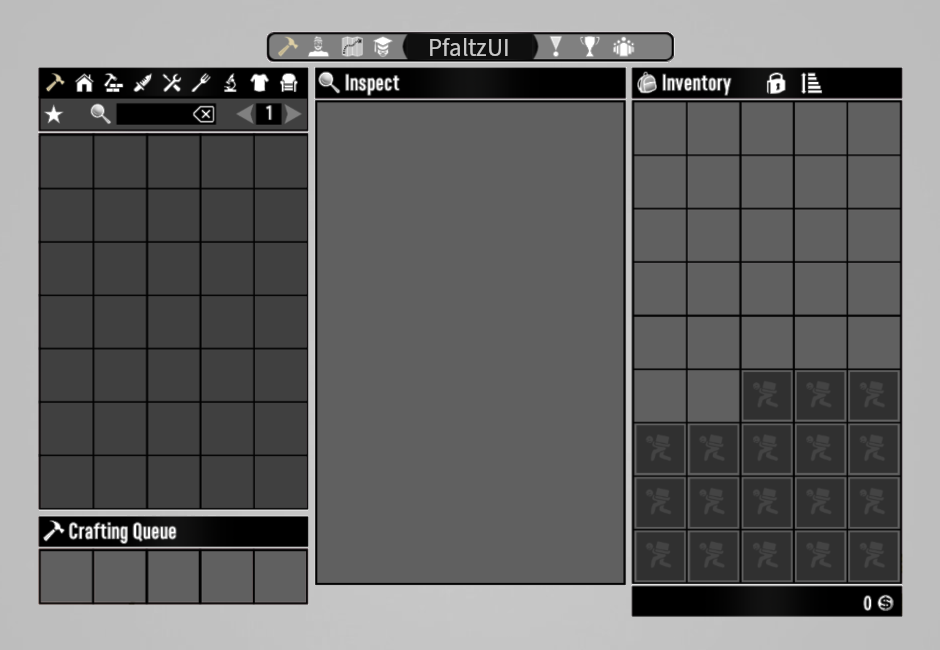
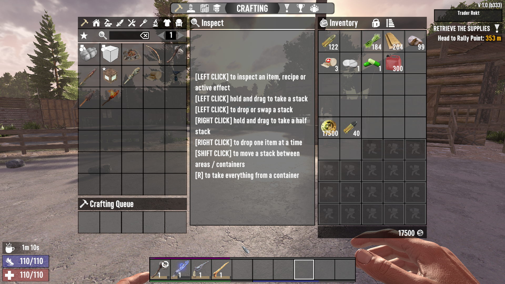
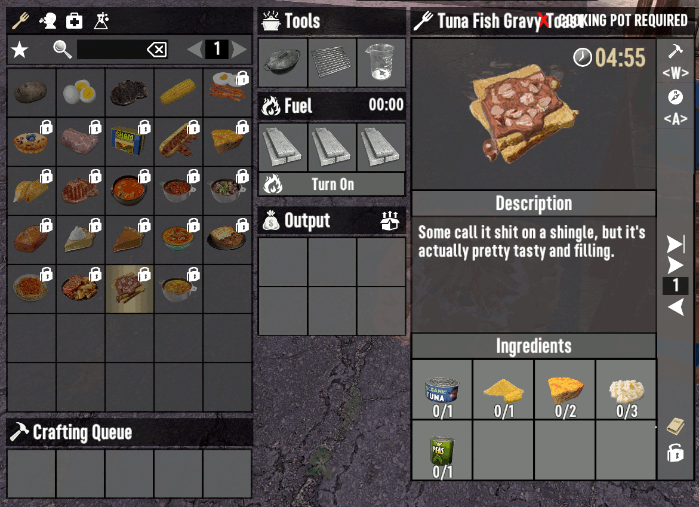
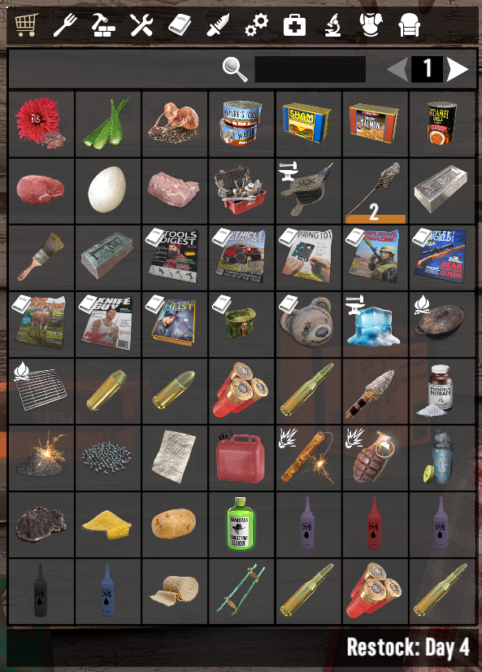
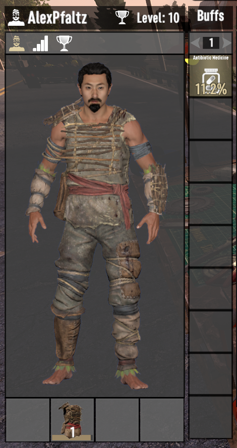

# PfaltzUI
Server-side Vertical UI for "7 days to die"

The peculiarity of this user interface mod is the vertical windows, the following have been changed: the crafting window, the view window of the crafting item, the backpack. Also, apart from the main mod, there is an "Extension of the standard character window", "Increasing the bag by 63 or 90 cells", "Adding a colored substrate to the cells with items and to the viewing window of the item. which reflects the quality of the item". You only need to install the mod on the server side. I was inspired to develop this mod by [SMX](https://github.com/Sirillion ) and [RamosUI](https://7daystodiemods.com/ramos-xui/)

  
  
  
  
  

