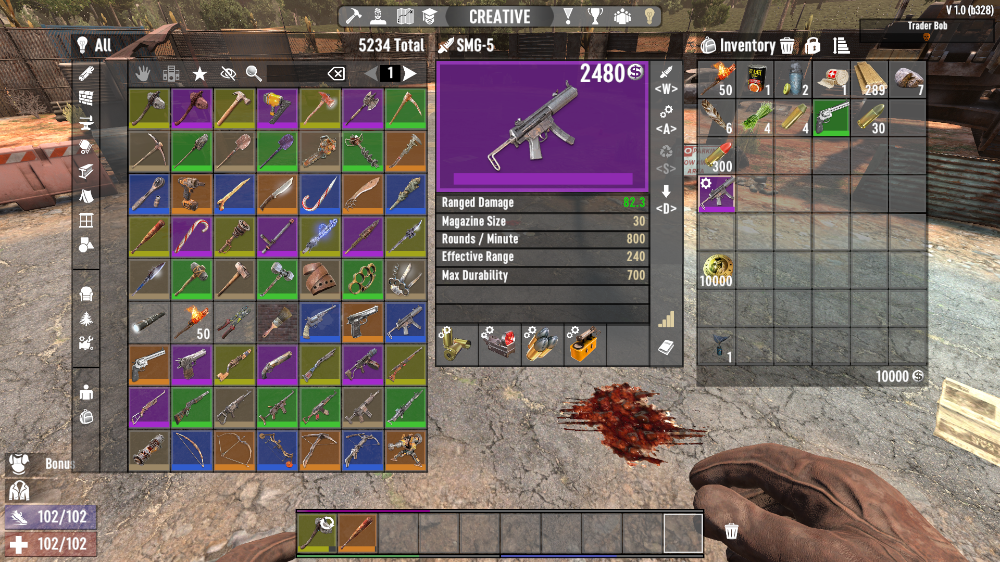
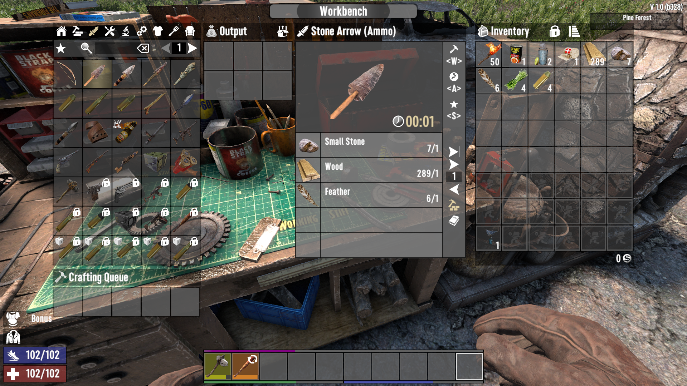
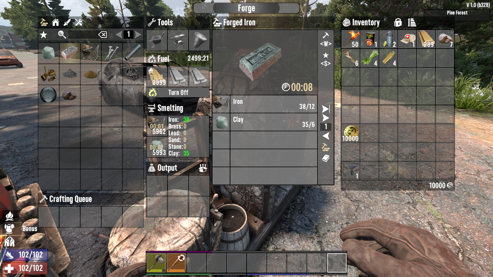
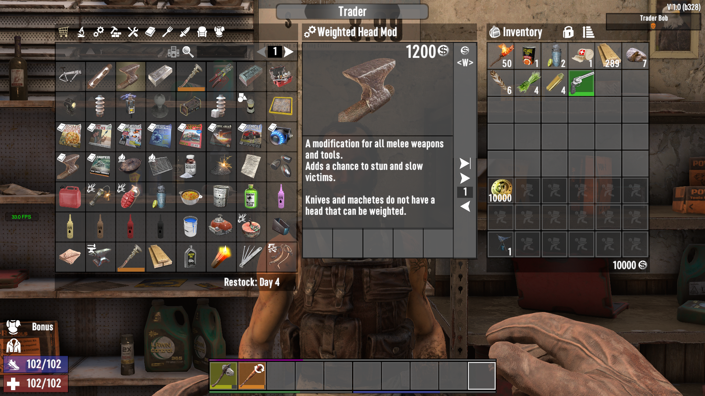

# PfaltzUI
Custom UI for "7 days to die"

I like [SMX](https://github.com/Sirillion ) and [RamosUI](https://7daystodiemods.com/ramos-xui/), but both of these modifications must be installed by clients, I decided to do something similar, Only on the server side.

  
  
  
  
  
  

